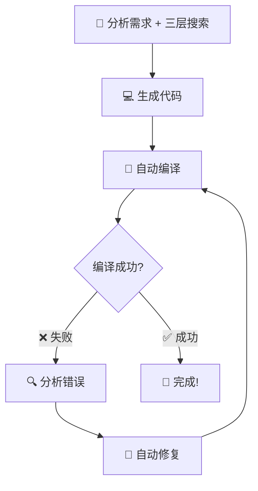

# Unreal 引擎源码学习与插件开发 AI Skill

*通过学习 Unreal 源码，参考官方实现来开发自己的插件功能或修改引擎*

---

## ✨ 核心特性

| 功能 | 说明 |
|:-----|:-----|
| 📚 **三层智能搜索** | UE5 官方知识库 + 网络搜索 + 源码分析 |
| 🔍 **源码深度分析** | 自动定位、提取关键代码模式和最佳实践 |
| 💡 **代码生成** | 基于源码生成可直接使用的插件框架 |
| 🔧 **自动编译** | 支持 Development / DebugGame 两种编译模式 |
| 🔄 **迭代修复** | 编译失败时自动分析错误并修复 |

---

## 🚀 快速开始

### 1. 配置引擎路径

编辑 `config.json`，设置你的 Unreal 引擎安装路径：

| 配置项 | 示例值 |
|:-------|:-------|
| `unrealEnginePath` | `"D:/Epic Games/UE_5.4"` |
| `searchDepth` | `5` |
| `focusModules` | `["Core", "Engine", "UnrealEd", "Slate"]` |

### 2. 触发 Skill

在对话中使用 `使用 UnrealCodeImitator` 关键词可确保激活：

| 示例命令 |
|:---------|
| `使用 UnrealCodeImitator，帮我实现一个自定义属性编辑器` |
| `使用 UnrealCodeImitator，学习 Unreal 中的反射系统` |
| `使用 UnrealCodeImitator，分析 Slate 框架` |

---

## 📖 触发关键词

| 类型 | 关键词示例 |
|:-----|:-----------|
| 📚 参考源码 | `参考 Unreal 源码` `学习 UE 源码` `看 Unreal 源码` |
| 🔍 学习实现 | `学习 Unreal 中的` `Unreal 是怎么实现的` `参考官方实现` |
| 💡 基于源码开发 | `基于 Unreal 源码` `遵循 Unreal 最佳实践` |
| 🛠️ 实现功能 | `实现一个` `创建一个` `类似 Unreal 的` |
| ⭐ **直接调用** | **`使用 UnrealCodeImitator`** （推荐，命中率最高） |
| 🔧 编译 | `编译` / `编译V` (Development) · `编译G` (DebugGame) |

---

## 🔍 三层搜索策略

<table>
<tr>
<td align="center" width="33%">

### 1️⃣ UE5 官方知识库
⭐ **最权威、最快**

官方 API 文档  
推荐实现方式  
最新特性

</td>
<td align="center" width="33%">

### 2️⃣ 网络搜索
⭐⭐ **范围广、包含技巧**

社区最佳实践  
优化技巧  
多角度方案

</td>
<td align="center" width="33%">

### 3️⃣ 源码分析
⭐⭐⭐ **最详细、最深入**

底层实现细节  
代码设计模式  
性能优化要点

</td>
</tr>
</table>

---

## 🔧 编译功能

| 命令 | 编译配置 | 适用场景 |
|:-----|:---------|:---------|
| `编译` / `编译V` | Development Editor | 日常开发和测试（推荐） |
| `编译G` | DebugGame Editor | 调试插件崩溃或逻辑问题 |

> 💡 **推荐用法：**
> 
> `使用 UnrealCodeImitator，实现一个事件系统，编译G，有错误自动修复`

---

## 📁 项目结构

| 文件 | 说明 |
|:-----|:-----|
| 📄 `SKILL.md` | 完整功能说明 |
| ⚙️ `config.json` | 配置文件（引擎路径等） |
| 🔧 `scripts/compile.bat` | 编译脚本（唯一入口） |
| 📂 `references/` | 参考文档目录 |

---

## 📋 使用示例

### 示例 1：创建自定义编辑器面板

> `使用 UnrealCodeImitator，帮我创建一个建筑编辑器的布局面板，参考编辑器 UI 实现`

**Skill 自动执行：** 查询 UE5 知识库 → 网络搜索 → 分析源码 → 生成代码

### 示例 2：性能优化

> `使用 UnrealCodeImitator，我的游戏加载时间很长，如何优化 Asset Loading？`

### 示例 3：快速 API 查询

> `使用 UnrealCodeImitator，查询 Enhanced Input System 如何使用`

### 示例 4：实现功能并编译（⭐ 推荐）

| 常用命令 |
|:---------|
| `使用 UnrealCodeImitator，实现一个自定义属性编辑器，然后编译G` |
| `使用 UnrealCodeImitator，创建一个事件系统插件并编译` |
| `使用 UnrealCodeImitator，生成一个资源管理器，编译G，如果有错误自动修复` |

---

## 🔄 典型工作流程

> **一句话触发完整的开发流程：**
> 
> `使用 UnrealCodeImitator，实现一个自定义属性编辑器，编译G，如果有错误自动修复直到成功`

### 自动执行流程

| 步骤 | 操作 | 说明 |
|:-----|:-----|:-----|
| 1️⃣ | 📝 分析需求 | 查询 UE5 知识库 + 网络搜索 + 源码分析 |
| 2️⃣ | 💻 生成代码 | 创建 `.h` 和 `.cpp` 文件 |
| 3️⃣ | 🔧 自动编译 | 执行 `compile.bat DebugGame` |
| 4️⃣ | 🔍 分析错误 | 读取编译日志，定位错误原因 |
| 5️⃣ | 🔄 自动修复 | 修正代码中的问题 |
| 6️⃣ | 🔁 重新编译 | 重复 3-5 步直到成功 |
| 7️⃣ | ✅ 完成 | 输出成功信息 |

### 实际对话示例

| 角色 | 内容 |
|:-----|:-----|
| **你** | `使用 UnrealCodeImitator，给我实现一个简单的 Actor 对象池，编译G，有错误就修复` |
| **AI** | ✓ 已查询 UE5 知识库 |
| | ✓ 已搜索社区最佳实践 |
| | ✓ 已分析 FActorPool 源码 |
| | 📝 生成 `FSimpleActorPool.h` 和 `.cpp` |
| | 🔧 开始编译 (DebugGame)... |
| | ❌ 编译错误：缺少 `#include "GameFramework/Actor.h"` |
| | 🔄 修复中... |
| | 🔧 重新编译... |
| | ✅ **编译成功！** |

---

## ⚠️ 注意事项

| 项目 | 说明 |
|:-----|:-----|
| 📋 **配置路径** | 需要在 `config.json` 中配置正确的引擎路径 |
| ✅ **测试验证** | 生成的代码建议在实际项目中测试验证 |
| 🔧 **编译环境** | 编译功能需要正确安装 Visual Studio 和 Unreal Engine |
